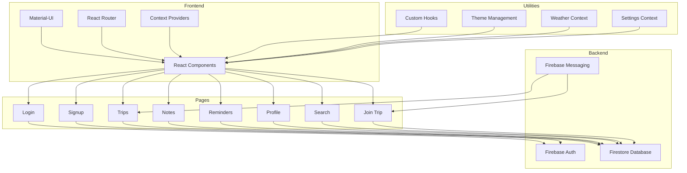

    

    <b>Automatic Architecture Diagrams from Code</b> 
    <a href="https://github.com/swark-io/swark">GitHub</a> • <a href="https://swark.io">Website</a> • <a href="mailto:contact@swark.io">Contact Us</a>

## Usage Instructions

1. **Render the Diagram**: Use the links below to open it in Mermaid Live Editor, or install the [Mermaid Support](https://marketplace.visualstudio.com/items?itemName=bierner.markdown-mermaid) extension.
2. **Recommended Model**: If available for you, use `claude-3.5-sonnet` [language model](vscode://settings/swark.languageModel). It can process more files and generates better diagrams.
3. **Iterate for Best Results**: Language models are non-deterministic. Generate the diagram multiple times and choose the best result.

## Generated Content
**Model**: GPT-4o - [Change Model](vscode://settings/swark.languageModel)  
**Mermaid Live Editor**: [View](https://mermaid.live/view#pako:eNp1k81u6yAQhV8FsW5eIItKid38O0njVF3gLqb2xEa1wcJwda-qvnvBhnC76O47MzAzZxCftJQV0jktRK2gb8g1LQQhg3mf5EpJoVFULkjIgl0QSk0S2fVSoNDD25RYsgw0Kg7t7GXrY4k_fJHGpnwwZYkr-FeTs5J_eIVqKjG2-NF5CeXHvfETW3GF7zAgWRjd-GKrMTpoqZCkoMHlfWodL2Q4DFBzUf_S6Aw1DtOtDTtIe9LX2LKc18L0Xu7YVfE-ON6zo9QY1MF67bi42yEkY9bgjbdhoCPLEVQZRj-xneSCuIq_jPWiecs1D6OdWWKs045spPwITZ7ZtcHOWgRhTXT2QXziwl4RdIOK-HX7eG6n0NruYviRuHdfkNnskWwibiPuIu4jHiJmEY8RT1Pl5SgWDpOIaUAnNqN4criNuBtx5XAf8RAxi3iMeAroxDoaWP8_1DlO8hzxEjEPSB9oh6oDXtm_8llQ7fZe0DkpaIU3MK0u6Jc9ZPrKfoSUg33Ejs61MvhAwWiZ_xNl0EqauqHzG7QDfn0DWSEPTg) | [Edit](https://mermaid.live/edit#pako:eNp1k81u6yAQhV8FsW5eIItKid38O0njVF3gLqb2xEa1wcJwda-qvnvBhnC76O47MzAzZxCftJQV0jktRK2gb8g1LQQhg3mf5EpJoVFULkjIgl0QSk0S2fVSoNDD25RYsgw0Kg7t7GXrY4k_fJHGpnwwZYkr-FeTs5J_eIVqKjG2-NF5CeXHvfETW3GF7zAgWRjd-GKrMTpoqZCkoMHlfWodL2Q4DFBzUf_S6Aw1DtOtDTtIe9LX2LKc18L0Xu7YVfE-ON6zo9QY1MF67bi42yEkY9bgjbdhoCPLEVQZRj-xneSCuIq_jPWiecs1D6OdWWKs045spPwITZ7ZtcHOWgRhTXT2QXziwl4RdIOK-HX7eG6n0NruYviRuHdfkNnskWwibiPuIu4jHiJmEY8RT1Pl5SgWDpOIaUAnNqN4criNuBtx5XAf8RAxi3iMeAroxDoaWP8_1DlO8hzxEjEPSB9oh6oDXtm_8llQ7fZe0DkpaIU3MK0u6Jc9ZPrKfoSUg33Ejs61MvhAwWiZ_xNl0EqauqHzG7QDfn0DWSEPTg)

